# OpenClaw Dashboard（English）

**1one Lobster Office** — a lightweight [Next.js](https://nextjs.org/) dashboard for your [OpenClaw](https://github.com/openclaw/openclaw) bots: agents, models, sessions, stats, **six locales**, **five UI themes**, **three pixel “game” scenes**, and optional MySQL sync — in one place.

## Background

When running multiple OpenClaw agents across different platforms (Feishu, Discord, etc.), managing and monitoring them becomes increasingly complex — which bot uses which model? Are the platforms connected? Is the gateway healthy? How are tokens being consumed?

The UI is driven by your **local OpenClaw tree** (`openclaw.json`, agents, sessions). **No MySQL is required** for day-to-day use. Optionally, you can enable **MySQL** to mirror config/agents/channels/sessions and inspect sync status (see **Optional MySQL (sync & metrics)** below).

Recent UX work includes **six UI languages** (with SEA packs in `lib/locales/`), **five visual themes** (not just dark/light), **three Pixel Office “game” scenes** (classic office, starship bridge, mushroom grove — each with its own map topology and atmosphere), and a richer **Models** page (who uses which model, probes, presets, add-to-config). Details below.

## Features

- **Home / Bot overview (`/`)** — Agent cards (model, platforms, session stats), gateway health, **same theme switcher as sidebar**, group-chat hints, **Agent Task Tracking** (subagents + cron jobs from `/api/agent-activity`; keeps the last “live” snapshot when everyone is idle/offline or the API returns an empty list)
- **OneOne dashboard (`/oneone-dashboard`)** — Compact dashboard variant with the same data family as home
- **Pixel Office (`/pixel-office`)** — Canvas “game” with **Classic / Starship / Grove** scenes, edit-save layout, optional critters, heatmap & idle rank, Gateway SRE character; see **Languages, themes, pixel worlds & live data**
- **Models (`/models`)** — Providers/models, **used-by agents**, context limits, per-model test, presets, **add model → config** after a successful probe; see **Languages, themes, pixel worlds & live data**
- **Channels (`/channels`)** — Channel-oriented view
- **Sessions (`/sessions`)** — Per-agent sessions (DM / group / cron), tokens, connectivity test
- **Statistics (`/stats`)** — Token usage and response-time trends (day/week/month) with SVG charts
- **Alerts (`/alerts`)** — Rules (e.g. model down, bot silent) with Feishu notifications
- **Skills (`/skills`)** — Installed skills with search/filter
- **Web Chat (`/chat`)** — Browser chat against your OpenClaw Gateway (not in the main sidebar; open by URL)
- **Gateway health** — Polling + link to OpenClaw web UI
- **Platform tests** — Feishu/Discord bindings and DM sessions
- **Auto refresh** — Manual, 10s, 30s, 1m, 5m, 10m

### Languages, themes, pixel worlds & live data

- **Internationalization** — Sidebar language selector: **简体中文**, **繁體中文**, **English**, **Bahasa Melayu**, **Bahasa Indonesia**, **ไทย**. Large zh / zh-TW / en tables live in `lib/i18n.tsx`; **ms / id / th** ship as `lib/locales/ms.json`, `id.json`, `th.json`. Missing keys **fall back** to English, then Simplified Chinese. Maintainers can run **`npm run i18n:merge-sea`** to merge SEA locale chunk files.

- **Themes (five skins)** — Not “Chinese vs English” and not only two modes: **dark (deep sea)**, **light (minimal)**, **cyber blue**, **warm orange**, and **forest green** — the same `ThemeSwitcher` as the home page, applied via **`data-theme`** on `<html>` and stored in **`localStorage`**.

- **Pixel Office — three game scenes** — **Classic office** (original pixel art + office floorplan), **Starship bridge** (ship topology, **starfield**, cyan frame / glow), **Mushroom grove** (forest topology, **walkable stream** tiles, green ambience). Implemented in `lib/pixel-office/layout/alternateLayouts.ts` and `gameThemes.ts`. The page supports **layout edit, undo/redo, save**, optional **“bugs”** critter overlay, **agent activity heatmap**, **slacking leaderboard**, **Gateway on-call SRE** character tied to health checks, HUD / nameplate polish, and **decorative floating code** while agents work. Layout file: **`$OPENCLAW_HOME/pixel-office/layout.json`**. After changing the art pipeline, run **`npm run generate-pixel-assets`** to regenerate sprites.

- **Models workspace** — Shows **which agents use each model**, **per-model test** (with optional **temporary API key**), **model-probe presets** for internal gateways, and **Add model** writing through **`/api/config/add-provider-model`** once the probe succeeds. JSON alignment is documented in **`docs/openclaw-models-config.md`**.

- **Live configuration** — The dashboard still reads **`openclaw.json`**, per-agent dirs, and session files under **`OPENCLAW_HOME`**. The UI does **not** need a database; **MySQL** is optional for sync/metrics only (see below).

## Main routes

| Path | Purpose |
|------|---------|
| `/` | Home — agents + task tracking |
| `/oneone-dashboard` | Alternate dashboard |
| `/pixel-office` | Pixel office / game-style scene |
| `/models` | Models & probes |
| `/channels` | Channels |
| `/sessions` | Sessions |
| `/stats` | Statistics |
| `/alerts` | Alerts |
| `/skills` | Skills |
| `/chat` | Gateway web chat |

API routes live under `app/api/` (e.g. `agent-activity`, `config`, `openclaw/*`, `pixel-office/*`, `storage/*`).

## Preview

All images live in [`docs/`](docs/).

### Bot dashboard
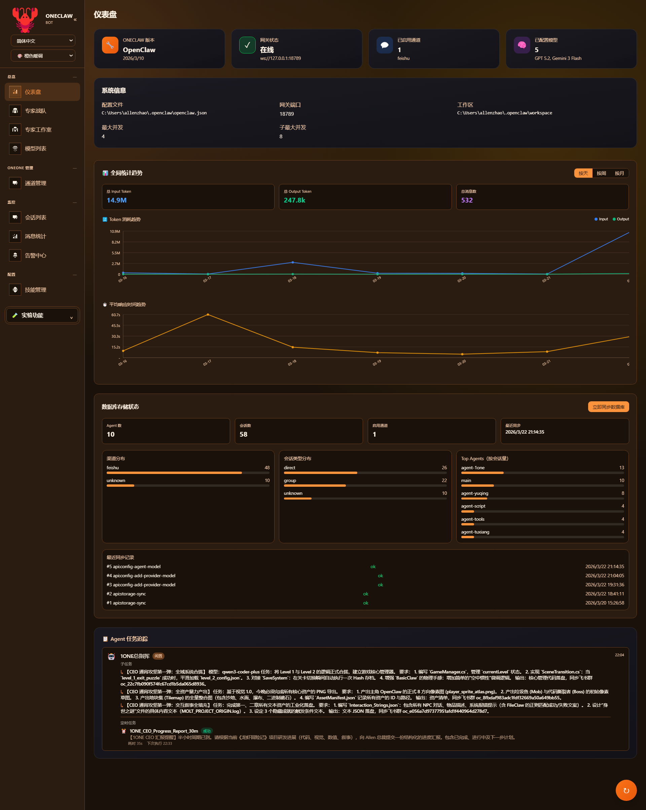

### Dashboard
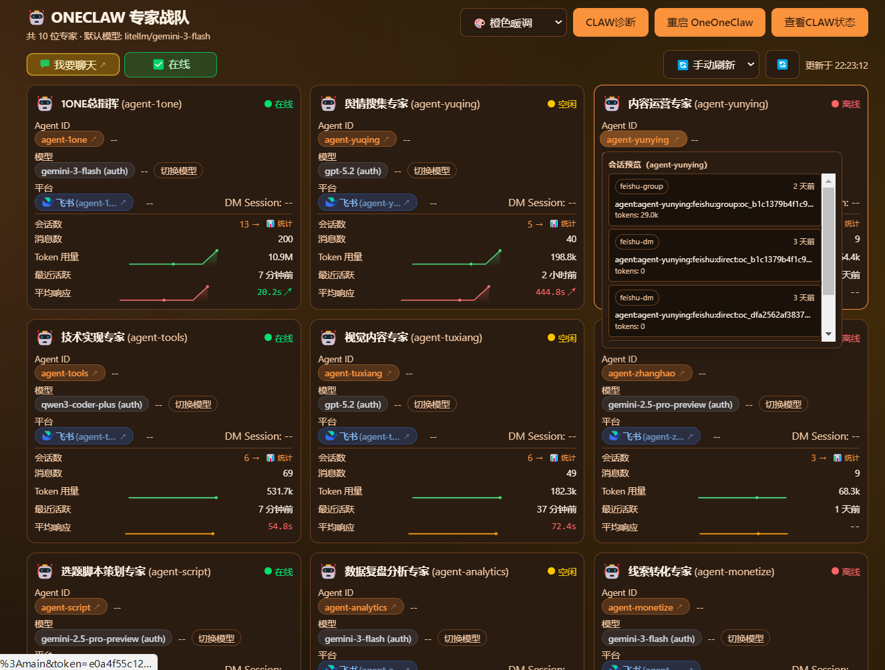

### Dashboard (wide preview)
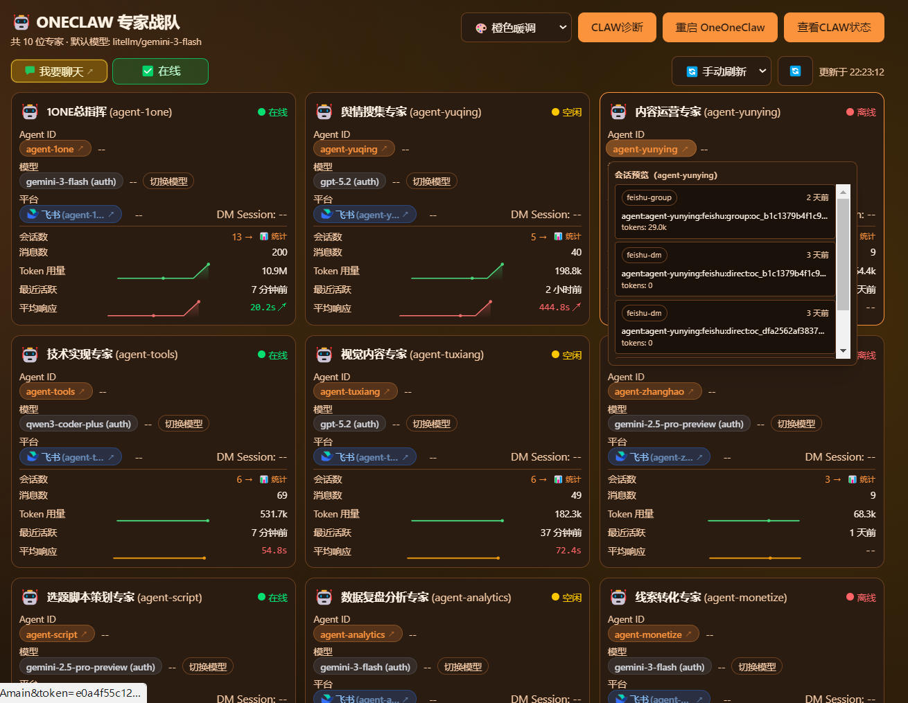

### Models
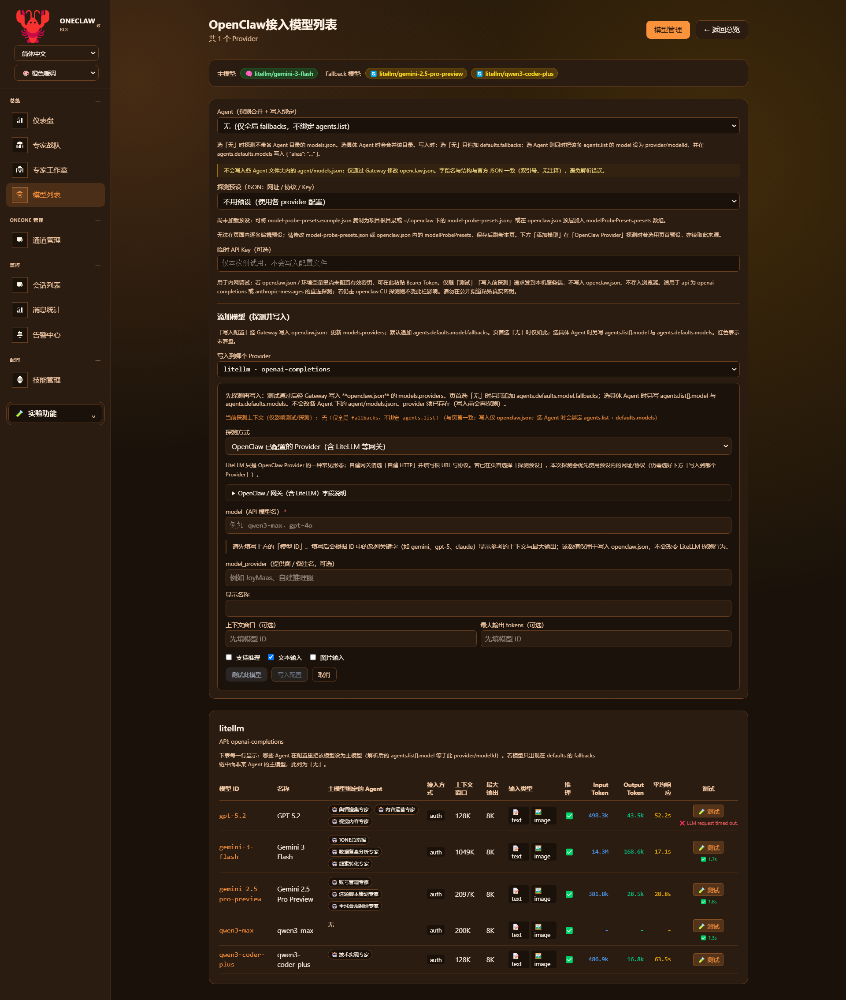

### Sessions
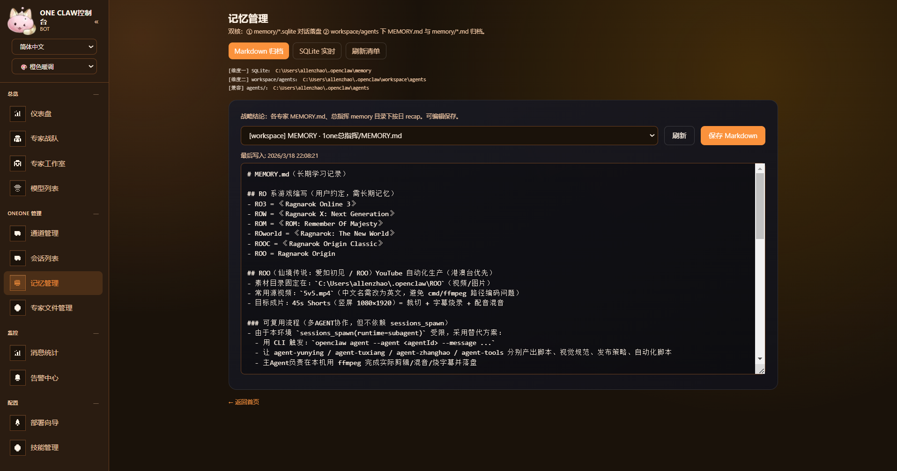

### Pixel Office
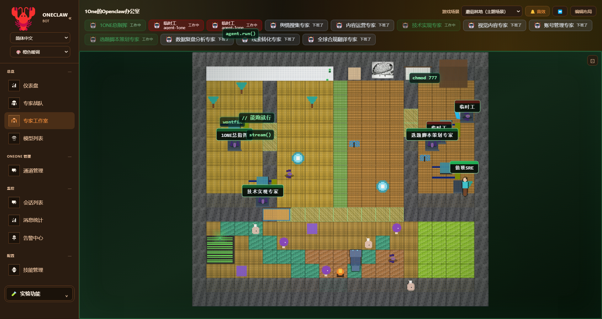

### Expert squad
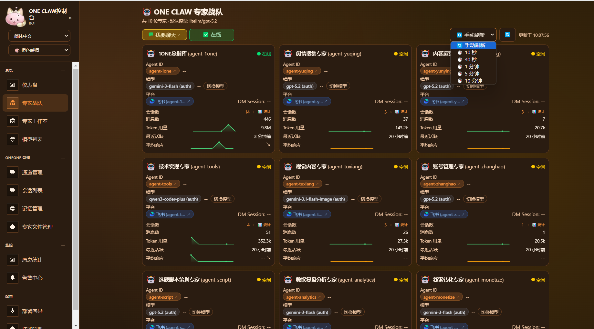

### Theme switching (5 skins: dark / light / cyber blue / warm orange / forest)
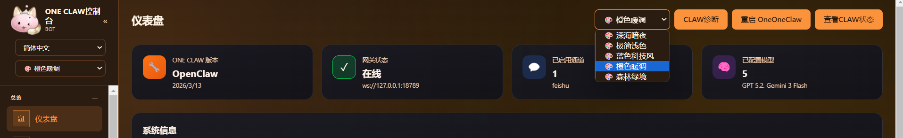

### Malay UI
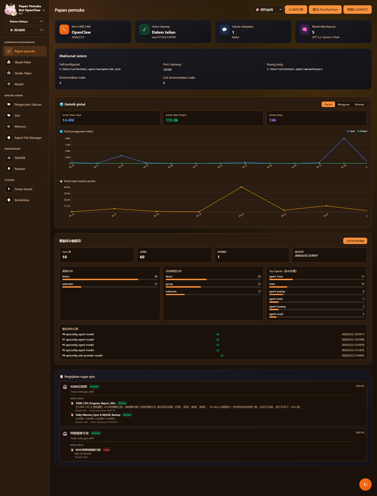

### Indonesian UI
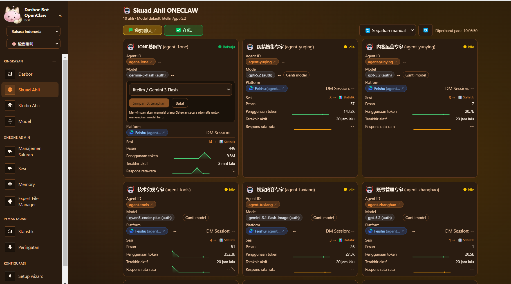

### Thai UI
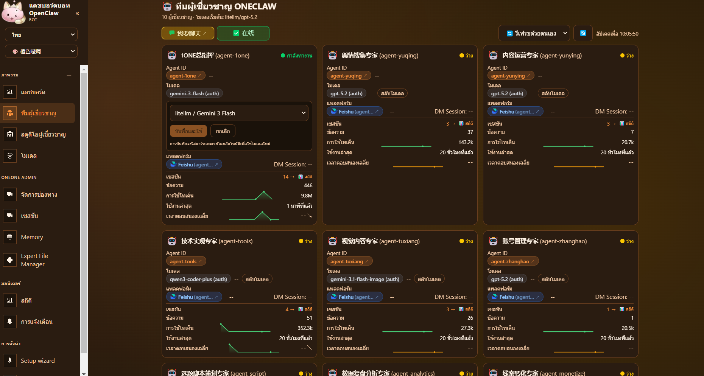

### Traditional Chinese UI
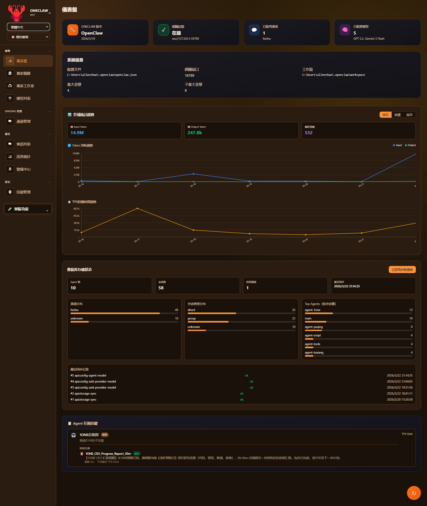

### Alert center
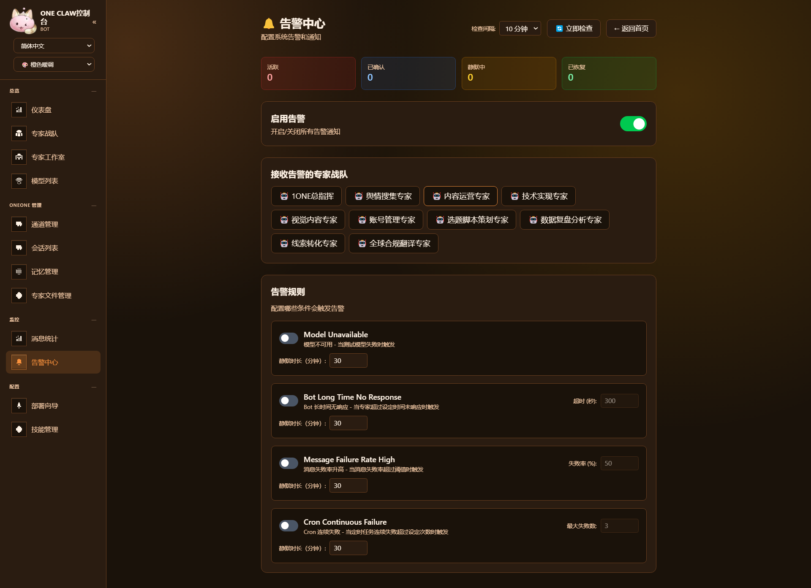

### Model switch
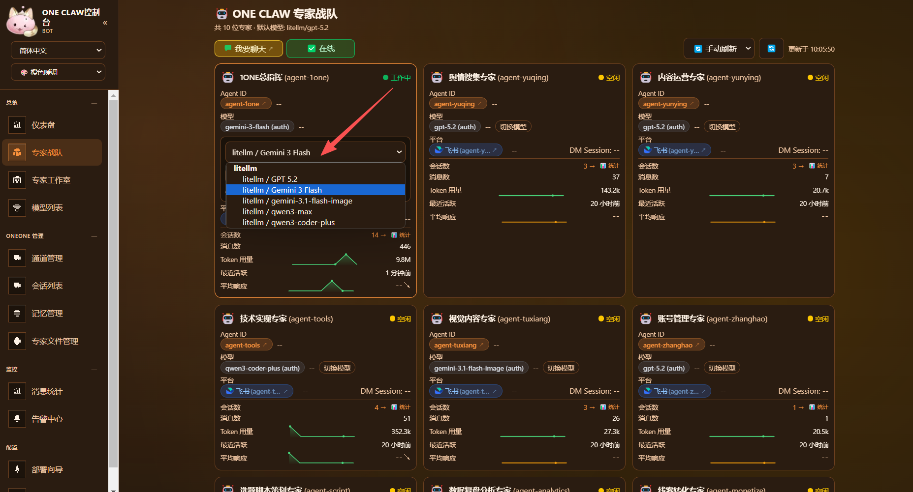

### Message statistics
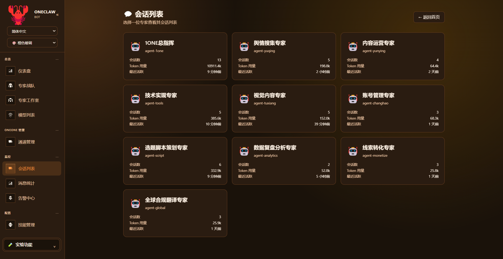

### Channel management
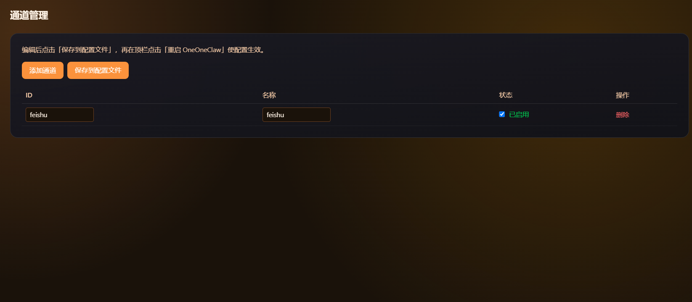

### Game scene — starship bridge
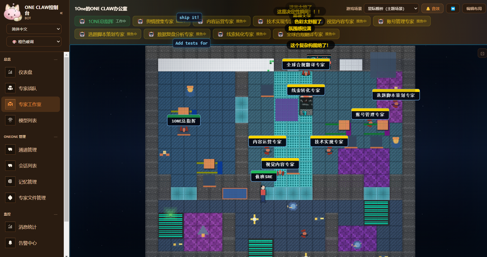

## Getting Started

See [Quick Start Guide](quick_start.md) for prompt / git / skill install options.

This app lives under the monorepo folder **`软件SOFT/龙虾可视化控制面板`**. After cloning [Openclaw-SKILLS-OneOne-](https://github.com/gaogg521/Openclaw-SKILLS-OneOne-.git):

```bash
git clone https://github.com/gaogg521/Openclaw-SKILLS-OneOne-.git
cd Openclaw-SKILLS-OneOne-/软件SOFT/龙虾可视化控制面板

npm install
npm run dev
```

- **Dev / local production** (`npm run dev` / `npm run start`) uses **port `3003`** (see `package.json`).
- Open **http://localhost:3003** in your browser.

Other scripts:

- `npm run build` — production build  
- `npm run start` — serve production build on port **3003**  
- `npm run generate-pixel-assets` — regenerate pixel-office asset sprites  
- `npm run i18n:merge-sea` — merge SEA locale chunks (maintainers)

## Tech Stack

- **Next.js 16** (App Router) + **React 19** + TypeScript  
- **Tailwind CSS v4**  
- Primary data: filesystem + `openclaw.json` under `OPENCLAW_HOME`  
- **Optional:** `mysql2` — sync/metrics APIs if MySQL is configured (`.env.example`)

## Requirements

- Node.js 18+
- OpenClaw installed with config at `~/.openclaw/openclaw.json`

## Configuration

By default, the dashboard reads config from `~/.openclaw/openclaw.json`. That file must be **strict JSON** (OpenClaw uses `JSON.parse`): **no** `//` or `/* */` comments and **no** trailing commas. The dashboard’s save path uses `JSON.stringify` and never injects comments.

To use a custom path:

- **Option A**: Create `.env.local` in the project root (recommended):
  ```env
  OPENCLAW_HOME=C:/Users/YourUsername/.openclaw
  ```
  (Use forward slashes on Windows. See `.env.example`.)

- **OpenClaw CLI path** (needed for **Save to config** / Gateway `config.patch` when your IDE’s `npm run dev` does not inherit npm global `PATH` on Windows): set `OPENCLAW_CLI` in `.env.local`, e.g. `C:/Users/You/AppData/Roaming/npm/openclaw.cmd`. See `.env.example`.

- **Models JSON shape** (`models.providers`, merge with `agents/*/agent/models.json`, `agents.defaults.models` aliases): see **[docs/openclaw-models-config.md](docs/openclaw-models-config.md)** (no secrets; describes how the dashboard aligns writes with typical `openclaw.json`).

- **Option B**: Set the environment variable when running:
  ```bash
  # Linux/macOS
  OPENCLAW_HOME=/opt/openclaw npm run dev
  # Windows PowerShell
  $env:OPENCLAW_HOME="C:\Users\YourUsername\.openclaw"; npm run dev
  ```

### Model probe presets (internal gateways)

To test with a JSON-defined **base URL + protocol + key** (same idea as an internal “chat debug” console) and your **model id**:

1. Copy `model-probe-presets.example.json` to `model-probe-presets.json` in the **project root** or **`$OPENCLAW_HOME`**, or add a `modelProbePresets.presets` array in `openclaw.json`.
2. On the **Models** page, pick a preset, then use **Test** on a row (or test inside **Add model**). Optional **temporary API key** overrides the preset key for that request only.

Supported `protocol` values: `anthropic`, `openai`. (`gemini` is not supported for direct probe yet.)

### Optional MySQL (sync & metrics)

Optional **mirror** of OpenClaw config/agents/channels/sessions into MySQL (tables are created on sync: `oc_*`). Configure in `.env.local` (see `.env.example`): `MYSQL_HOST`, `MYSQL_PORT`, `MYSQL_USER`, `MYSQL_PASSWORD`, `MYSQL_DATABASE` (default DB name `openclaw_visualization`).

- `POST /api/storage/sync` — run sync  
- `GET /api/storage/sync` — latest sync run status  
- `GET /api/storage/metrics` — row counts / storage-oriented metrics  

The rest of the dashboard does **not** depend on MySQL.

## Docker Deployment

The **Dockerfile** runs the Next **standalone** server with **`PORT=3000`** inside the container (unlike `npm run dev`, which uses **3003** on the host).

### Build Docker Image

```bash
cd 软件SOFT/龙虾可视化控制面板   # or your checkout root containing this folder
docker build -t openclaw-dashboard .
```

### Run Container

```bash
# Basic run (host 3000 -> container 3000)
docker run -d -p 3000:3000 openclaw-dashboard

# With custom OpenClaw config path
docker run -d --name openclaw-dashboard -p 3000:3000 -e OPENCLAW_HOME=/opt/openclaw -v /path/to/openclaw:/opt/openclaw openclaw-dashboard
```

---

# OpenClaw Bot Dashboard（中文）

**1one 龙虾办公室** — 基于 [Next.js](https://nextjs.org/) 的 OpenClaw 可视化控制台：**六种界面语言**、**五套主题皮肤**、**三套像素游戏场景**、模型探测与写入配置、会话/统计/告警/技能，以及与本地 `openclaw.json` 同步的实时数据（可选 MySQL 镜像）。

## 背景

当你在多个平台（飞书、Discord 等）上运行多个 OpenClaw Agent 时，管理和监控会变得越来越复杂——哪个机器人用了哪个模型？平台连通性如何？Gateway 是否正常？Token 消耗了多少？

界面数据主要来自本机 **OpenClaw 目录**（`openclaw.json`、agents、sessions 等）。**日常使用不依赖 MySQL**。可选启用 **MySQL**，把配置与 Agent/通道/会话镜像到库中并查看同步情况（见下文 **可选 MySQL（同步与指标）**）。

近期在 **语言（6 种界面语言 + 东南亚分包）**、**风格（5 套全局主题皮肤，非仅深浅两色）**、**像素「游戏」场景（经典办公室 / 星际舰桥 / 蘑菇林地三套独立拓扑与氛围）**、**模型页（谁在用哪张卡、探测预设、探测通过后写入配置）** 等方面做了较多改造；细项见下文 **「语言、风格、像素场景与实时配置」**。

## 功能

- **首页 / 机器人总览（`/`）** — Agent 卡片（模型、平台、会话统计）、Gateway 状态、与侧栏 **一致的五套主题切换**、群聊提示；**Agent 任务追踪**（子任务 + 定时任务，数据来自 `/api/agent-activity`；长时间无任务或接口返回空列表时，**保留上一次有活动时的展示**并提示为快照）
- **OneOne 仪表盘（`/oneone-dashboard`）** — 另一套紧凑仪表盘布局，数据维度与首页同类
- **像素办公室（`/pixel-office`）** — **经典办公室 / 星际舰桥 / 蘑菇林地** 三套场景，各自独立地图与视觉；支持布局编辑与小虫装饰、热力图与摸鱼榜、Gateway SRE 小人等；详见 **「语言、风格、像素场景与实时配置」**
- **模型（`/models`）** — Provider/模型列表、**各模型被哪些 Agent 使用**、上下文与 **单模型探测**、**内网 model-probe 预设**、探测成功后 **新增模型并写入配置**；详见 **「语言、风格、像素场景与实时配置」**
- **通道管理（`/channels`）** — 以通道为维度的管理视图
- **会话（`/sessions`）** — 按 Agent 浏览会话（私聊/群聊/定时等）、Token、连通性测试
- **消息统计（`/stats`）** — Token 与响应时间趋势（日/周/月），SVG 图表
- **告警中心（`/alerts`）** — 规则与飞书通知
- **技能（`/skills`）** — 已安装技能，支持搜索/筛选
- **网页对话（`/chat`）** — 浏览器直连 Gateway 的对话页（未放在主导航，需手动输入地址）
- **Gateway / 平台测试** — 健康轮询、飞书/Discord 与 DM 等一键测试
- **自动刷新** — 手动、10 秒、30 秒、1 分钟、5 分钟、10 分钟

### 语言、风格、像素场景与实时配置

- **国际化（远不止中英文切换）** — 侧栏语言下拉 **六种**：**简体中文、繁體中文、English、Bahasa Melayu、Bahasa Indonesia、ไทย**。简/繁/英主体文案在 **`lib/i18n.tsx`**；**马来语、印尼语、泰语** 使用独立文件 **`lib/locales/ms.json`、`id.json`、`th.json`**。缺键时按 **英文 → 简体中文** 回退。维护东南亚文案分包可运行 **`npm run i18n:merge-sea`** 合并分块。

- **界面风格（五套主题皮肤）** — 不是「只有中英文」或「只有深色/浅色」两种：当前提供 **深海暗夜、极简浅色、蓝色科技风、橙色暖调、森林绿境** 五套皮肤，与首页共用同一 **`ThemeSwitcher`**，通过 **`data-theme`** 作用于整站，并写入 **`localStorage`** 持久化。

- **像素办公室 = 多套「小游戏」场景** — **经典办公室**（原版像素美术 + 写字楼拓扑）、**星际舰桥**（飞船结构、**星空背景**、青蓝霓虹相框）、**蘑菇林地**（林间拓扑、**溪流可走水格**、森系光晕）。地图与主题实现见 **`lib/pixel-office/layout/alternateLayouts.ts`**、**`gameThemes.ts`**。页面支持 **布局编辑、撤销/重做、保存**，可选 **小虫（Bugs）** 装饰层，以及 **Agent 活跃热力图、摸鱼榜、Gateway 健康联动的值班 SRE 小人、HUD 名牌与画布描边** 等；Agent 工作中还有 **装饰性漂浮代码** 动效。布局文件：**`$OPENCLAW_HOME/pixel-office/layout.json`**。调整素材管线后可用 **`npm run generate-pixel-assets`** 重生成精灵图。

- **模型页能力** — 除列表与探测外，展示 **每个模型被哪些 Agent 主用**，支持 **临时 API Key**、**model-probe 预设**，以及探测通过后通过 **`/api/config/add-provider-model`** **写入 openclaw 配置**；字段形态见 **`docs/openclaw-models-config.md`**。

- **实时配置与数据** — 仍以 **`OPENCLAW_HOME` 下的 `openclaw.json`、agents、sessions** 等本地文件为权威来源；**不配数据库即可完整使用**。**MySQL** 仅为可选镜像与指标（见后文）。

## 主要路由

| 路径 | 说明 |
|------|------|
| `/` | 首页：总览 + 任务追踪 |
| `/oneone-dashboard` | OneOne 仪表盘 |
| `/pixel-office` | 像素办公室 |
| `/models` | 模型与探测 |
| `/channels` | 通道管理 |
| `/sessions` | 会话 |
| `/stats` | 统计 |
| `/alerts` | 告警 |
| `/skills` | 技能 |
| `/chat` | 网页对话 |

后端接口位于 `app/api/`（如 `agent-activity`、`config`、`openclaw/*`、`pixel-office/*`、`storage/*` 等）。

## 预览

以下截图均来自 [`docs/`](docs/) 目录（与上方英文 **Preview** 一一对应）。

### 机器人总览仪表盘


### 仪表盘


### 仪表盘（宽屏预览图）


### 模型列表


### 会话列表


### 像素办公室


### 专家战队


### 主题切换（五套皮肤：深浅 + 科技蓝 + 暖橙 + 森绿）


### 马来语界面


### 印尼语界面


### 泰语界面


### 繁体中文界面


### 告警中心


### 模型切换


### 消息统计


### 通道管理


### 游戏场景 · 星际舰桥


## 快速开始

更多安装方式（提示词 / Skill 等）见：[快速启动文档](quick_start.md)。

本应用在 monorepo 中的路径为 **`软件SOFT/龙虾可视化控制面板`**。克隆 [Openclaw-SKILLS-OneOne-](https://github.com/gaogg521/Openclaw-SKILLS-OneOne-.git) 后：

```bash
git clone https://github.com/gaogg521/Openclaw-SKILLS-OneOne-.git
cd Openclaw-SKILLS-OneOne-/软件SOFT/龙虾可视化控制面板

npm install
npm run dev
```

若你**只下载了本文件夹**，则直接进入该目录执行 `npm install` 与 `npm run dev` 即可。

- **`npm run dev` / `npm run start` 默认端口为 `3003`**（见 `package.json`）。
- 浏览器访问：**http://localhost:3003**

其它命令：`npm run build`（构建）、`npm run start`（生产模式，端口 3003）、`npm run generate-pixel-assets`（像素资源）、`npm run i18n:merge-sea`（维护者合并东南亚语言分包）。

## 技术栈

- **Next.js 16**（App Router）+ **React 19** + TypeScript  
- **Tailwind CSS v4**  
- 主数据源：本地文件与 `OPENCLAW_HOME` 下的 `openclaw.json`  
- **可选：** `mysql2`，配置 MySQL 后可用同步与指标接口（见 `.env.example`）

## 环境要求

- Node.js 18+
- 已安装 OpenClaw，配置文件位于 `~/.openclaw/openclaw.json`

## 自定义配置路径

默认读取 `~/.openclaw/openclaw.json`。该文件须为 **标准 JSON**（OpenClaw 用 `JSON.parse`）：**不能**写 `//`、`/* */` 注释，**不能**有尾随逗号；仪表盘经 Gateway 写入时使用 `JSON.stringify`，**不会**往文件里加注释。

若要指定其他目录：

- **方式一**：在项目根目录创建 `.env.local`（推荐）：
  ```env
  OPENCLAW_HOME=C:/Users/你的用户名/.openclaw
  ```
  （Windows 建议用正斜杠。可参考 `.env.example`。）

- **OpenClaw CLI 路径**：在 Cursor/IDE 里跑 `npm run dev` 时，若 **写入配置** / 调用 Gateway 报 `spawn openclaw ENOENT`，请在 `.env.local` 设置 `OPENCLAW_CLI`（或 `OPENCLAW_MJS` 指向 `openclaw.mjs`）。详见 `.env.example`。

- **方式二**：启动时设置环境变量：
  ```bash
  # Linux/macOS
  OPENCLAW_HOME=/opt/openclaw npm run dev
  # Windows PowerShell
  $env:OPENCLAW_HOME="C:\Users\你的用户名\.openclaw"; npm run dev
  ```

### 模型探测预设（内网网关）

用 JSON 固定 **网关地址、协议、Key**，再与列表里的 **模型 ID** 组合做直连探测（类似内网 Chat 调试台）：

1. 将 `model-probe-presets.example.json` 复制为项目根目录或 `$OPENCLAW_HOME` 下的 `model-probe-presets.json`，或在 `openclaw.json` 顶层增加 `modelProbePresets.presets` 数组。
2. 在 **模型** 页选择预设后，对单行点 **测试**（或 **新增模型** 内测试）。**临时 API Key** 仅覆盖当次请求。

`protocol` 支持：`anthropic`、`openai`（`gemini` 暂不做直连探测）。

**模型 JSON 结构说明**（与 `openclaw.json` 写入对齐）：[docs/openclaw-models-config.md](docs/openclaw-models-config.md)。

### 可选 MySQL（同步与指标）

可选将 OpenClaw 配置与 Agent/通道/会话 **镜像** 到 MySQL（首次同步会建表 `oc_*`）。在 `.env.local` 中配置 `MYSQL_HOST`、`MYSQL_PORT`、`MYSQL_USER`、`MYSQL_PASSWORD`、`MYSQL_DATABASE`（默认库名 `openclaw_visualization`），说明见 `.env.example`。

- `POST /api/storage/sync` — 执行同步  
- `GET /api/storage/sync` — 最近一次同步状态  
- `GET /api/storage/metrics` — 存储相关指标  

**其它页面不依赖 MySQL**，不配库亦可完整使用仪表盘。

### Docker 说明

与本地 `npm run dev`（**3003**）不同，**Dockerfile** 内进程使用 **`PORT=3000`**，映射端口时请使用 `-p 3000:3000`（或自行改 Dockerfile / 环境变量）。

## 作者联系方式（contact）
GitHub：[gaogg521](https://github.com/gaogg521)

感谢初始代码作者 [xmanrui](https://github.com/xmanrui)。# gaogg521-openclaw-Visual-Control-Panel
