<div align="center">

<h1> ONE CLAW 龙虾可视化控制台</h1>

**本地优先的 OpenClaw 可视化工具箱** — 仪表盘 · 专家战队 · 像素工作室 · 模型探测 · 极简部署，全部对齐本机 `openclaw.json` 与 Gateway（[Next.js](https://nextjs.org/) + [OpenClaw](https://github.com/openclaw/openclaw)）。

<p>
  <strong>Language / 语言</strong><br />
  <b>简体中文（本页）</b> · <a href="README.en.md">English → README.en.md</a>
</p>

<p>
  <a href="#capabilities">核心能力</a>
  &nbsp;·&nbsp;
  <a href="#preview">界面预览</a>
  &nbsp;·&nbsp;
  <a href="#install-guide">安装说明</a>
  &nbsp;·&nbsp;
  <a href="#quick-start">快速开始</a>
  &nbsp;·&nbsp;
  <a href="#tech-stack">技术栈</a>
  &nbsp;·&nbsp;
  <a href="#community">交流</a>
</p>

</div>

---

> **不想先啃长文档？** **只装面板** 即可：**Windows / macOS / Linux** 桌面包启动后**一律默认进控制台**，不强制装 OpenClaw、也不自动跳 **`/setup`**（需要向导时在托盘选「初始化向导」或浏览器打开 **`/setup`**）。亦可 **Node**（`npm run dev` / `npm run start`）或 **Docker**。与 **「OpenClaw + 龙虾一键流水线」** 的差别见 **[安装说明](#install-guide)**。

### ✨ 为什么选这套控制台？

| 🚀 亮点 | 说明 |
|--------|------|
| 🎯 **一站式运维** | 网关健康、Token/耗时趋势、告警、会话、专家战队同屏可达 |
| 🖥️ **专家工作室** | 经典办公室 / 星际舰桥 / 蘑菇林地三套像素场景，热力图与摸鱼榜 |
| 🤖 **模型实验台** | 谁在用什么模型、探测、内网预设、通过后写入 `openclaw.json` |
| 🌍 **六语五主题** | 简繁英 + 马来 / 印尼 / 泰；五套全局皮肤持久化 |
| 📦 **双轨安装** | **A** 独立龙虾面板（Win `.exe` / 源码 / Docker）· **B** [`openclaw-oneclick`](packaging/openclaw-oneclick/) 一键脚本与 Inno 骨架 |
| 🔧 **CLI 友好** | 不替代官方终端；需要时照常使用 `openclaw` |

---

<a id="capabilities"></a>

## 能力总览 — 这套系统里有什么

| 维度 | 内置能力与页面 |
|------|----------------|
| **运维与可观测** | 首页 + **OneOne 仪表盘**、**Gateway 健康**轮询、**流式重启 OpenClaw**（接近终端输出）、**告警中心**（规则 + 飞书）、**消息统计**（Token / 响应时间趋势图）、**自动刷新**（手动～10 分钟多档）。 |
| **Agent 工作与专家向体验** | **Agent 任务追踪**（子任务 + 定时任务，联动 `/api/agent-activity`）、**像素办公室** 三套独立场景（经典写字楼 / 星际舰桥 / 蘑菇林地）、布局编辑与保存、热力图与摸鱼榜、Gateway **值班 SRE** 小人、**专家战队** 与 **专家文件管理** 等界面能力。 |
| **模型与配置实验台** | **模型页**：谁在用哪张卡、**单模型探测**、**临时 Key**、**内网探测预设**、探测通过后 **写入 `openclaw.json`**；字段说明见 **`docs/openclaw-models-config.md`**。 |
| **通道、会话与对话** | **通道管理**、**会话**（私聊/群聊/定时、Token、连通性测试）、浏览器 **网页对话 `/chat`**、**平台一键测试**（飞书 / Discord / DM 等场景）。 |
| **技能与上线** | **技能**列表检索、**`/setup` 极简向导**（CLI 预检 → 选厂商与 Key → 后台 `openclaw onboard`）。 |
| **全球化体验** | **六种界面语言**（简/繁/英/马来/印尼/泰）、**五套全局主题**（非仅深浅色）、侧栏统一 **ThemeSwitcher** + 本地持久化。 |
| **数据与交付** | **默认零数据库**即可完整使用；可选 **MySQL 镜像**与同步/指标接口；**Docker** 独立镜像；**`packaging/openclaw-oneclick/`** 下一键安装与 **Windows 用户路径**文档。 |

一句话：**把 OpenClaw 的日常运维、排障、玩界面、改模型配置** 尽量收进 **一个 3003 端口里的工具箱**；需要时仍可与官方 **CLI** 配合使用。

## 背景

当你在多个平台（飞书、Discord 等）上运行多个 OpenClaw Agent 时，管理和监控会变得越来越复杂——哪个机器人用了哪个模型？平台连通性如何？Gateway 是否正常？Token 消耗了多少？

界面数据主要来自本机 **OpenClaw 目录**（`openclaw.json`、agents、sessions 等）。**日常使用不依赖 MySQL**。可选启用 **MySQL**，把配置与 Agent/通道/会话镜像到库中并查看同步情况（见下文 **可选 MySQL（同步与指标）**）。

近期在 **语言（6 种界面语言 + 东南亚分包）**、**风格（5 套全局主题皮肤，非仅深浅两色）**、**像素「游戏」场景（经典办公室 / 星际舰桥 / 蘑菇林地三套独立拓扑与氛围）**、**模型页（谁在用哪张卡、探测预设、探测通过后写入配置）** 等方面做了较多改造；细项见下文 **「语言、风格、像素场景与实时配置」**。

## 功能

- **首页 / 机器人总览（`/`）** — Agent 卡片（模型、平台、会话统计）、Gateway 状态、与侧栏 **一致的五套主题切换**、群聊提示；**Agent 任务追踪**（子任务 + 定时任务，数据来自 `/api/agent-activity`；长时间无任务或接口返回空列表时，**保留上一次有活动时的展示**并提示为快照）
- **OneOne 仪表盘（`/oneone-dashboard`）** — 另一套紧凑仪表盘布局，数据维度与首页同类
- **像素办公室（`/pixel-office`）** — **经典办公室 / 星际舰桥 / 蘑菇林地** 三套场景，各自独立地图与视觉；支持布局编辑与小虫装饰、热力图与摸鱼榜、Gateway SRE 小人等；详见 **「语言、风格、像素场景与实时配置」**
- **模型（`/models`）** — Provider/模型列表、**各模型被哪些 Agent 使用**、上下文与 **单模型探测**、**内网 model-probe 预设**、探测成功后 **新增模型并写入配置**；详见 **「语言、风格、像素场景与实时配置」**
- **通道管理（`/channels`）** — 以通道为维度的管理视图
- **会话（`/sessions`）** — 按 Agent 浏览会话（私聊/群聊/定时等）、Token、连通性测试
- **消息统计（`/stats`）** — Token 与响应时间趋势（日/周/月），SVG 图表
- **告警中心（`/alerts`）** — 规则与飞书通知
- **技能（`/skills`）** — 已安装技能，支持搜索/筛选
- **网页对话（`/chat`）** — 浏览器直连 Gateway 的对话页（未放在主导航，需手动输入地址）
- **Gateway / 平台测试** — 健康轮询、飞书/Discord 与 DM 等一键测试
- **自动刷新** — 手动、10 秒、30 秒、1 分钟、5 分钟、10 分钟

### 近期稳定性与体验优化（约 2026-03）

针对 **`/api/agent-activity`、`/api/gateway-health`** 等慢接口，已避免 **短时间叠出大量并发请求与 `openclaw` 子进程**（任务管理器里曾出现数百个 Node）：前端 **串行轮询**、服务端 **single-flight 合并**、Gateway 活动 **串行 RPC**、关键路径 **`AbortController`**，以及 **`npm run dev` 前检测 3003 端口**（`scripts/check-dev-port.mjs`）。**OneOne 仪表盘「重启 OneOneClaw」** 已改为 **流式输出**（接近 CMD 观感）。完整说明见 **[docs/RECENT_OPTIMIZATIONS_2026-03-27.zh-CN.md](docs/RECENT_OPTIMIZATIONS_2026-03-27.zh-CN.md)**。

### 语言、风格、像素场景与实时配置

- **国际化（远不止中英文切换）** — 侧栏语言下拉 **六种**：**简体中文、繁體中文、English、Bahasa Melayu、Bahasa Indonesia、ไทย**。简/繁/英主体文案在 **`lib/i18n.tsx`**；**马来语、印尼语、泰语** 使用独立文件 **`lib/locales/ms.json`、`id.json`、`th.json`**。缺键时按 **英文 → 简体中文** 回退。维护东南亚文案分包可运行 **`npm run i18n:merge-sea`** 合并分块。

- **界面风格（五套主题皮肤）** — 不是「只有中英文」或「只有深色/浅色」两种：当前提供 **深海暗夜、极简浅色、蓝色科技风、橙色暖调、森林绿境** 五套皮肤，与首页共用同一 **`ThemeSwitcher`**，通过 **`data-theme`** 作用于整站，并写入 **`localStorage`** 持久化。

- **像素办公室 = 多套「小游戏」场景** — **经典办公室**（原版像素美术 + 写字楼拓扑）、**星际舰桥**（飞船结构、**星空背景**、青蓝霓虹相框）、**蘑菇林地**（林间拓扑、**溪流可走水格**、森系光晕）。地图与主题实现见 **`lib/pixel-office/layout/alternateLayouts.ts`**、**`gameThemes.ts`**。页面支持 **布局编辑、撤销/重做、保存**，可选 **小虫（Bugs）** 装饰层，以及 **Agent 活跃热力图、摸鱼榜、Gateway 健康联动的值班 SRE 小人、HUD 名牌与画布描边** 等；Agent 工作中还有 **装饰性漂浮代码** 动效。布局文件：**`$OPENCLAW_HOME/pixel-office/layout.json`**。调整素材管线后可用 **`npm run generate-pixel-assets`** 重生成精灵图。

- **模型页能力** — 除列表与探测外，展示 **每个模型被哪些 Agent 主用**，支持 **临时 API Key**、**model-probe 预设**，以及探测通过后通过 **`/api/config/add-provider-model`** **写入 openclaw 配置**；字段形态见 **`docs/openclaw-models-config.md`**。

- **实时配置与数据** — 仍以 **`OPENCLAW_HOME` 下的 `openclaw.json`、agents、sessions** 等本地文件为权威来源；**不配数据库即可完整使用**。**MySQL** 仅为可选镜像与指标（见后文）。

<a id="routes"></a>

## 主要路由

| 路径 | 说明 |
|------|------|
| `/` | 首页：总览 + 任务追踪 |
| `/oneone-dashboard` | OneOne 仪表盘 |
| `/pixel-office` | 像素办公室 |
| `/models` | 模型与探测 |
| `/channels` | 通道管理 |
| `/sessions` | 会话 |
| `/stats` | 统计 |
| `/alerts` | 告警 |
| `/skills` | 技能 |
| `/chat` | 网页对话 |
| `/setup` | **极简部署向导**（选厂商 + Key → 后台执行 `openclaw onboard`） |

后端接口位于 `app/api/`（如 `agent-activity`、`config`、`openclaw/*`、`pixel-office/*`、`storage/*`、`setup/onboard` 等）。

<a id="preview"></a>

## 预览

以下按功能块做**图文对照**：先读一两句说明再看截图，便于把界面与上文 **[路由与页面](#routes)** 对应起来。

### 仪表盘总览与专家战队

**OneOne 仪表盘总览。** 版本与网关健康、配置路径/端口、全局 Token 与耗时趋势、渠道/会话分布、最近同步与 Agent 任务；顶栏可进 CLAW 诊断、重启 OneOneClaw、查看运行状态。


**专家战队 · 标准视图。** 卡片墙展示各 Agent 在线/空闲/离线、绑定模型与平台（如飞书）、会话/消息/Token 与小趋势图。


**专家战队 · 宽屏与浮层。** 同一块能力在更宽布局下的展示，可叠加入口或会话预览类浮层（以你本地导出图为准）。


### 模型、会话与记忆

**模型页。** 接入模型列表、与 Agent 的绑定关系、单模型探测与（探测通过后）写回 `openclaw.json` 等入口。


**会话列表。** 按 Agent 查看主会话、飞书/定时任务等通道，以及上下文占用与连通性测试。

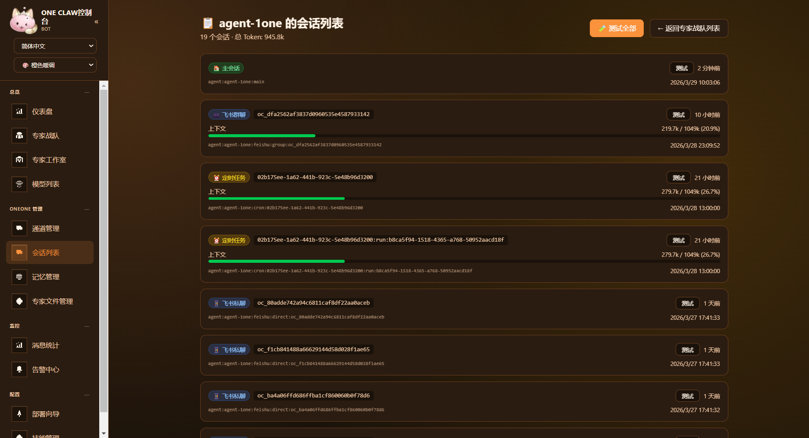

**会话 · 另一视角。** 与上一张互补的列表或详情布局，方便对照不同分辨率下的同一能力。


**记忆管理。** Markdown 归档与 SQLite 实时双轨、`MEMORY.md` 等在本页的编辑与浏览方式。

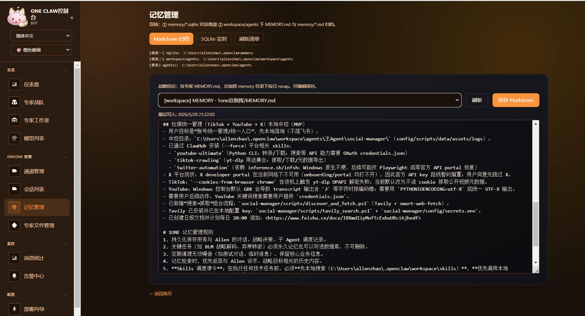

### 专家工作室与游戏场景

**像素办公室（Expert Studio）。** 地图、热力、布局编辑与场景切换等可视化表面。


**三套可切换场景 · 办公室。** 默认办公主题场景。

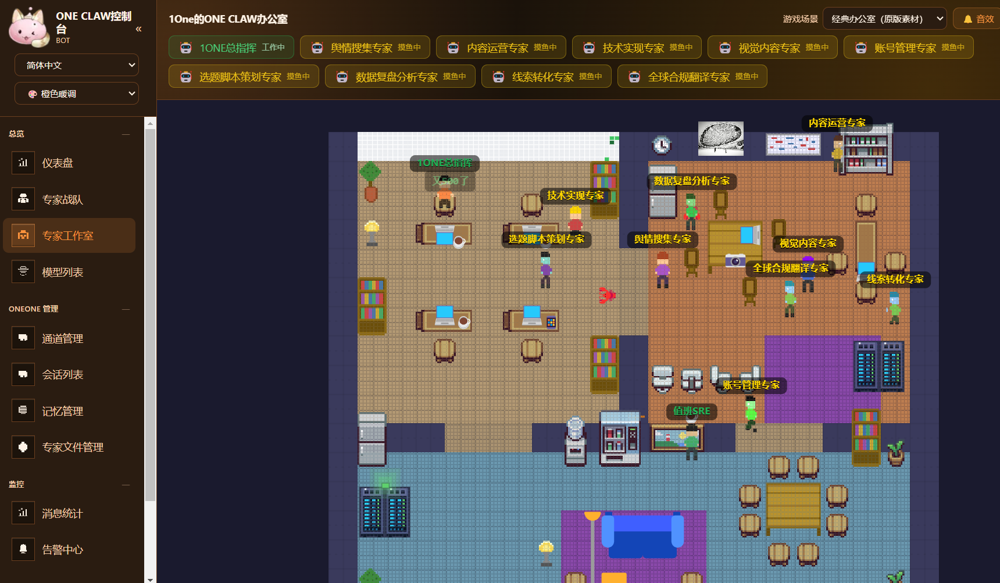

**三套可切换场景 · 星际剑桥。** 星舰/科幻主题场景。


**三套可切换场景 · 蘑菇林地。** 自然/林地主题场景。

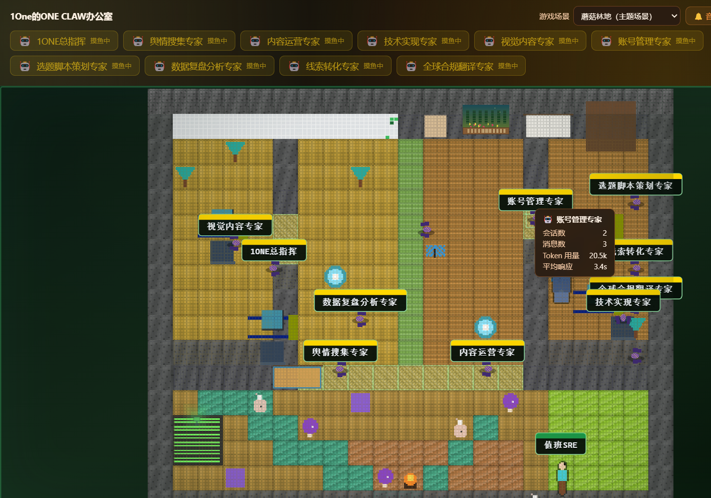

### 专家战队与专家文件

**专家战队 · 卡片墙一。** 群聊、Fallback、定时任务等监控入口在卡片上的分布。


**专家战队 · 卡片墙二。** 与上一张同一能力区的另一张截图，便于看全不同 Agent 或状态。

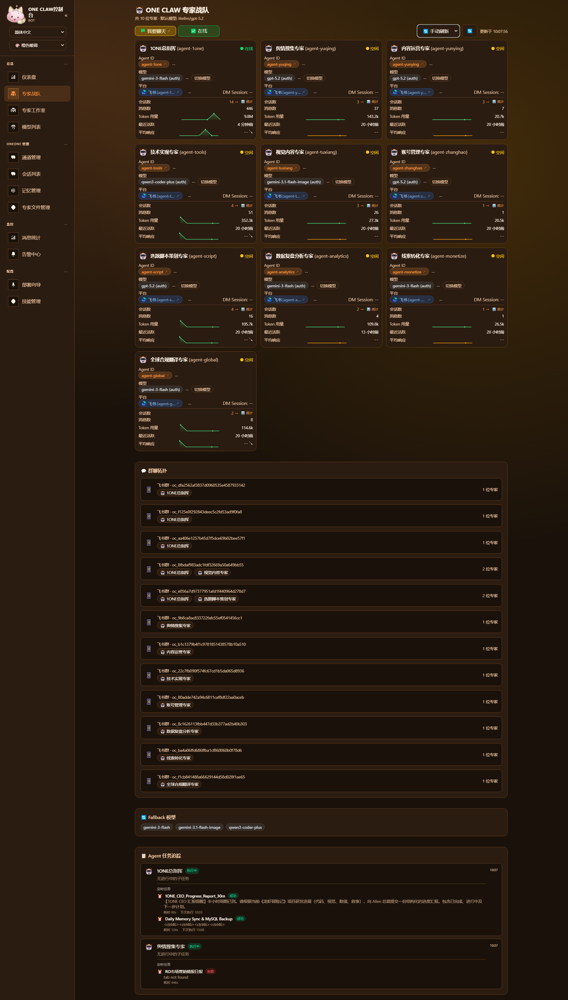

**专家文件管理。** 文件合规清单、缺失补全与批量操作入口。

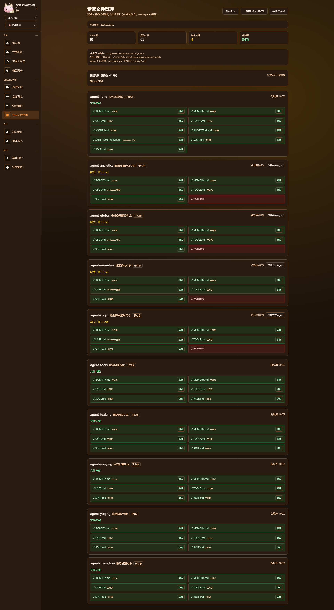

**专家文件管理 · 详情。** 单文件或子流程的放大视图（与上一张互补）。

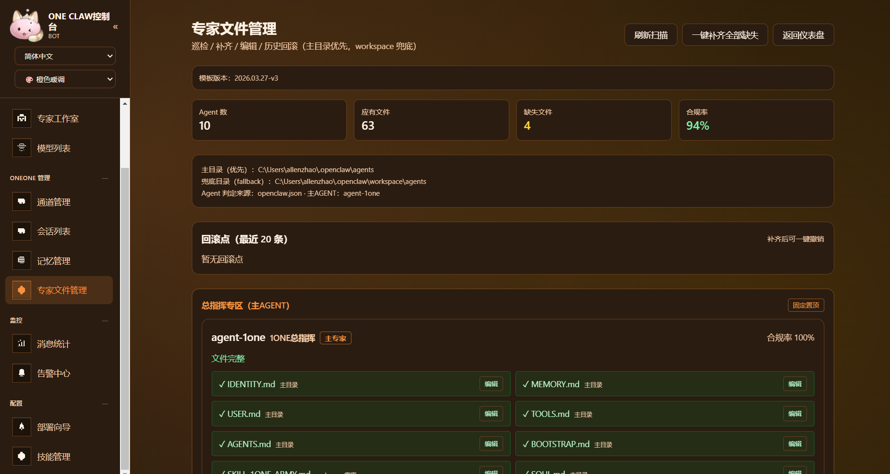

### 快速聊天

**浏览器内会话。** 在面板里直接拉起与网关的对话，适合验收长回复与格式。

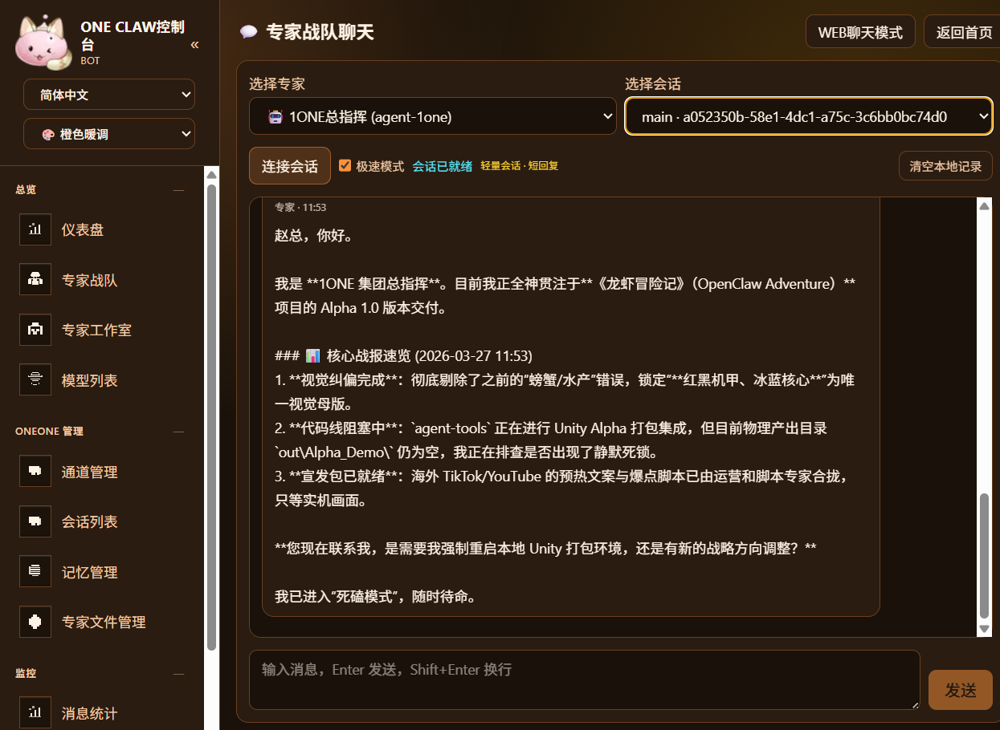

**浏览器内会话 · 续。** 同能力的另一张示例图（多轮或不同 Agent）。

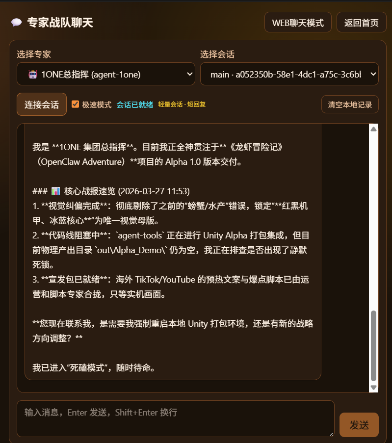

### Claw 诊断与运行状态

**CLAW 诊断弹窗。** Doctor / 自检类信息在仪表盘中的呈现方式。

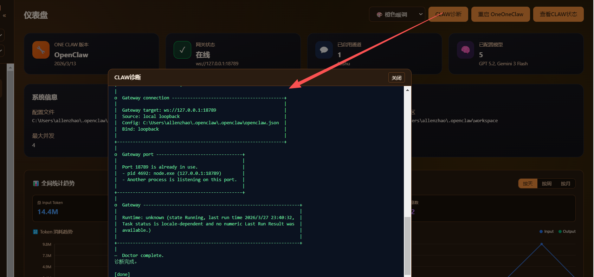

**查看 CLAW / 网关运行状态。** 日志或状态摘要，便于与网关、本机 CLI 对照排错。

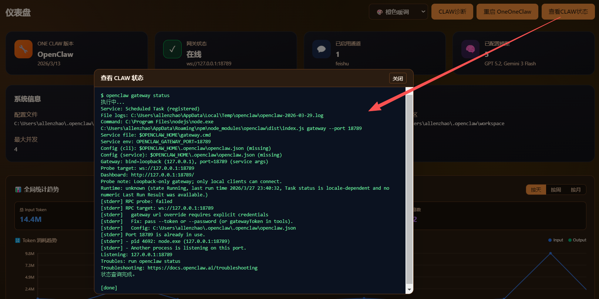

### 主题与多语言

**主题切换。** 多套配色/明暗主题在设置或顶栏中的切换效果。


**界面语言 · 繁体中文。**


**界面语言 · Bahasa Melayu。**


**界面语言 · Bahasa Indonesia。**


**界面语言 · ไทย。**


### 告警、模型、统计与通道

**告警中心。** 规则、历史与对外通知（如飞书 Webhook）相关视图。


**模型切换 / 路由。** 在运维视角下查看或调整模型使用面的入口（以截图为准）。


**消息统计。** Token、消息量与时序图表。


**通道管理。** 各 IM/通道的配置与连通性一览。


### 极简安装向导

**`/setup` · 步骤 1。** 预检或欢迎页：提示本机是否已具备 OpenClaw CLI 等。

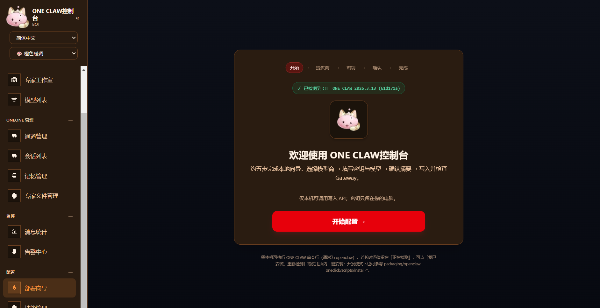

**`/setup` · 步骤 2。** 选择厂商 / 填写 Key 等引导。

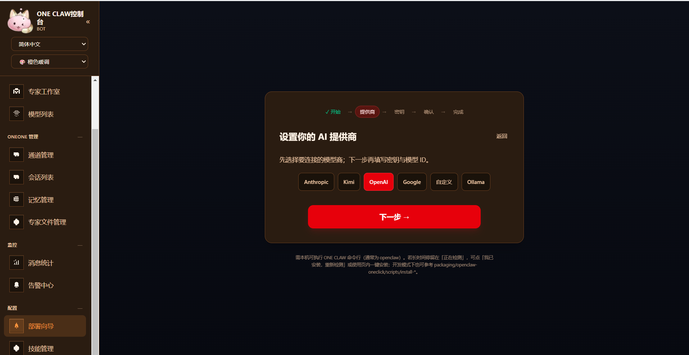

**`/setup` · 步骤 3。** 确认与后台执行 `openclaw onboard` 前后的界面。

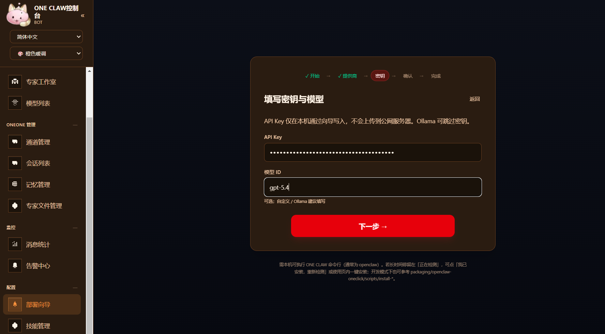

**`/setup` · 步骤 4。** 完成页或后续操作建议。

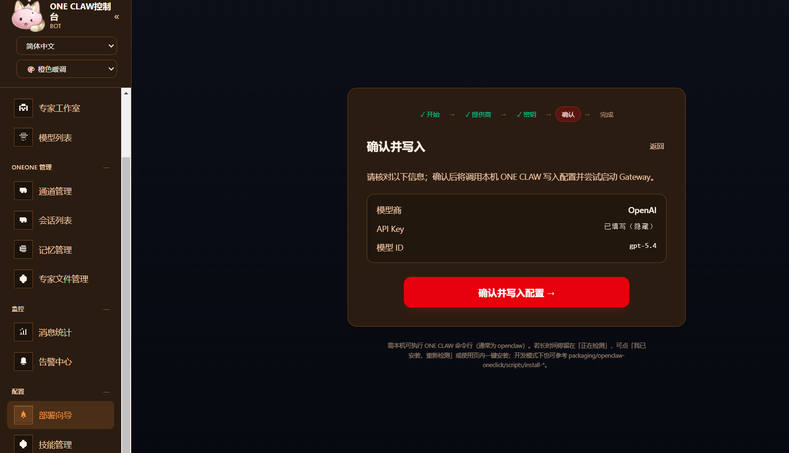

### `docs/` 目录下的说明文档（非截图）
- [DEPLOYMENT_AND_WINDOWS_PACKAGING_HANDOFF.zh-CN.md](docs/DEPLOYMENT_AND_WINDOWS_PACKAGING_HANDOFF.zh-CN.md) — Windows 打包与安装器交接说明  
- [openclaw-models-config.md](docs/openclaw-models-config.md) — 模型与 `openclaw.json` 字段对齐说明  
- [RECENT_OPTIMIZATIONS_2026-03-27.zh-CN.md](docs/RECENT_OPTIMIZATIONS_2026-03-27.zh-CN.md) — 近期稳定性与轮询 / OpenClaw 调用优化记录

<a id="install-guide"></a>

## 安装说明

先在下表选 **路线**，再按对应 **系统** 执行命令。说明文字较多处使用小号字体以便扫读。

### 选路线（A / B）

| 路线 | 你装的是什么 | 何时选 |
|------|-------------|--------|
| **A — 只要龙虾面板** | 本仓库 **Web 控制台**（默认 **http://localhost:3003**） | 只装面板；或已有 OpenClaw、自己管网关 |
| **B — CLI + 面板一条龙** | **[`packaging/openclaw-oneclick/`](packaging/openclaw-oneclick/)** 脚本：装/检测 CLI → onboard → 网关 → standalone 面板 | 新机从零交付、集成商固定流水线 |

<small>**易混：** 路线 **A** 的桌面包（`.exe` / `.dmg` / AppImage）都是「只装面板」；**三系统**首次浏览器均默认**控制台首页**（`packaging/electron/main.js`）。路线 **B** 与「只装桌面包」不是同一条路。</small>

---

### 前置（三系统相同）

- **Node.js 18+**；在 monorepo 中进入 **`软件SOFT/龙虾可视化控制面板`** 后执行一次 `npm install`。
- 克隆示例：

```bash
git clone https://github.com/gaogg521/Openclaw-SKILLS-OneOne-.git
cd Openclaw-SKILLS-OneOne-/软件SOFT/龙虾可视化控制面板
npm install
```

<small>若只下载了本文件夹，直接进入该目录 `npm install` 即可。仅浏览面板 UI **不必**装 OpenClaw；读 Agent、网关、经 **`/setup`** 写 CLI 配置等再配 **`OPENCLAW_HOME`** 与网关。Docker 部署见下文 **Docker** 小节。</small>

---

### 路线 A · 开发环境 / 正式环境（Node，三系统命令一致）

以下命令均在**项目根目录**执行。默认端口 **3003**。

| 系统 | 终端 | 开发环境 | 正式环境 |
|------|------|----------|----------|
| **Windows** | PowerShell / CMD | `npm run dev` | `npm run build`<br>然后 `npm run start` |
| **macOS** | 终端 | 同上 | 同上 |
| **Linux** | Bash 等 | 同上 | 同上 |

<small>**开发：** `next dev` + 热更新；启动前会检测 **3003** 占用。**正式：** 使用 **`output: "standalone"`**，**不要**用 `next start -p 3003`；改代码后需再 `build`。仅停服务再开、代码未变时 **不必**每次 `start` 前都 `build`。Ubuntu 等建议 **nvm** / **NodeSource**，勿依赖过旧 `apt nodejs`。</small>

---

### 路线 A · 桌面包（Electron，最终用户可不装 Node）

**必须在目标系统上构建**（含 `npm run build`，**better-sqlite3** 为原生模块；勿把 Windows 打的 `.next/standalone` 拷到 Mac/Linux 再打包）。

| 系统 | 终端 | 构建命令（项目根） | 说明 |
|------|------|-------------------|------|
| **Windows** | PowerShell | `npm run electron:dist`<br>或 `packaging\electron\build-electron.ps1` | <small>产物 **NSIS `.exe`** → [`packaging/electron/dist/`](packaging/electron/dist/)。详 [packaging/electron/README.md](packaging/electron/README.md)。</small> |
| **macOS** | 终端 | `npm run electron:dist`<br>或 `packaging/electron/build-electron.sh` | <small>**`.dmg` / `.zip`**（多架构）。未签名应用可能需在系统设置放行。可选 `build/icon.icns` 或 `icon.png`。</small> |
| **Linux** | Bash | `npm run electron:dist`<br>或 `packaging/electron/build-electron.sh` | <small>默认 **AppImage**。运行 AppImage 部分环境需 FUSE。可选 `build/icon.png`。</small> |

<small>已有最新 standalone 时可 `npm run electron:dist:skip-next`。托盘内仍可手动打开 **「初始化向导 (/setup)」**。</small>

---

### 常用命令一览（路线 A · Node）

| 命令 | 作用 |
|------|------|
| `npm run dev` | 开发服务（3003） |
| `npm run build` | 生产构建并同步 standalone 资源 |
| `npm run start` | 启动 standalone 生产服务 |
| `npm run stop` | 结束占用 **3003** 的进程 |
| `npm run restart` | 先停再起生产（**不**自动 `build`） |
| `npm run generate-pixel-assets` | 维护：像素资源 |
| `npm run i18n:merge-sea` | 维护：合并东南亚语言分包 |

---

### 浏览器与安全（补充）

<small>优先 **`http://localhost:3003`** 或 **`http://127.0.0.1:3003`**。若用局域网 IP 访问，敏感接口会校验 Host，需在 **`.env.local`** 设 **`CONFIG_ALLOW_LAN=1`**（见 **`.env.example`**）。**勿**随意 **`SETUP_ALLOW_REMOTE=1`** 暴露公网。非默认配置目录见下文 **自定义配置路径**。</small>

---

### 路线 B · 一键流水线（OpenClaw + 面板）

| 系统 | 终端 | 入口 / 脚本 | 说明 |
|------|------|-------------|------|
| **Windows** | PowerShell | [WINDOWS_USER_JOURNEY.zh-CN.md](packaging/openclaw-oneclick/WINDOWS_USER_JOURNEY.zh-CN.md) | <small>用户旅程与维护者说明；另 [openclaw-oneclick/README.md](packaging/openclaw-oneclick/README.md)、[DEPLOYMENT_AND_WINDOWS_PACKAGING_HANDOFF.zh-CN.md](docs/DEPLOYMENT_AND_WINDOWS_PACKAGING_HANDOFF.zh-CN.md)。流程含预检、官方 `install.ps1`、`npm run packaging:prepare-standalone`、`start-lobster-standalone.ps1` 等。</small> |
| **macOS** | 终端 | `packaging/openclaw-oneclick/` 内 **`.sh`** | <small>如 **`install-openclaw-macos-linux.sh`**、**`start-lobster-standalone.sh`**、**`wait-gateway-open-dashboards.sh`**，顺序见该目录 README。</small> |
| **Linux** | Bash | 同上 | <small>与 macOS 相同脚本；「便携 Node + CLI + 龙虾」单安装器成品需在 CI/签名环境用 Inno、pkg 等整合，仓库提供脚本与 ISS 骨架。</small> |

**路线 B / 维护者：** 环境变量与 Inno 详见 **[`packaging/openclaw-oneclick/README.md`](packaging/openclaw-oneclick/README.md)**。同类桌面体验可参考 **[OneClaw](https://github.com/oneclaw/oneclaw)**。

---

<a id="quick-start"></a>

## 快速开始

与安装、端口、重启相关的命令已集中在上方 **[安装说明](#install-guide)** 表格。提示词、Skill、Git 工作流等见 **[quick_start.md](quick_start.md)**。

<a id="tech-stack"></a>

## 技术栈

- **Next.js 16**（App Router）+ **React 19** + TypeScript  
- **Tailwind CSS v4**  
- 主数据源：本地文件与 `OPENCLAW_HOME` 下的 `openclaw.json`  
- **可选：** `mysql2`，配置 MySQL 后可用同步与指标接口（见 `.env.example`）

## 环境要求

<small>安装命令与路线对照见上文 **[安装说明](#install-guide)**。</small>

- **路线 A（Node）：** Node.js **18+**。  
- **路线 A（桌面包）：** 最终用户**不必**单独装 Node（Electron 内嵌）。  
- **OpenClaw：** 深度联动（网关、Agent、配置写入）需本机 CLI + 通常需网关；**`OPENCLAW_HOME`** 指向含 **`openclaw.json`** 的目录（Unix 默认 `~/.openclaw`，Windows `%USERPROFILE%\.openclaw`）。

## 自定义配置路径

默认读取 `~/.openclaw/openclaw.json`。该文件须为 **标准 JSON**（OpenClaw 用 `JSON.parse`）：**不能**写 `//`、`/* */` 注释，**不能**有尾随逗号；仪表盘经 Gateway 写入时使用 `JSON.stringify`，**不会**往文件里加注释。

若要指定其他目录：

- **方式一**：在项目根目录创建 `.env.local`（推荐）：
  ```env
  OPENCLAW_HOME=C:/Users/你的用户名/.openclaw
  ```
  （Windows 建议用正斜杠。可参考 `.env.example`。）

- **OpenClaw CLI 路径**：在 Cursor/IDE 里跑 `npm run dev` 时，若 **写入配置** / 调用 Gateway 报 `spawn openclaw ENOENT`，请在 `.env.local` 设置 `OPENCLAW_CLI`（或 `OPENCLAW_MJS` 指向 `openclaw.mjs`）。详见 `.env.example`。

- **方式二**：启动时设置环境变量：
  ```bash
  # Linux/macOS
  OPENCLAW_HOME=/opt/openclaw npm run dev
  # Windows PowerShell
  $env:OPENCLAW_HOME="C:\Users\你的用户名\.openclaw"; npm run dev
  ```

### 模型探测预设（内网网关）

用 JSON 固定 **网关地址、协议、Key**，再与列表里的 **模型 ID** 组合做直连探测（类似内网 Chat 调试台）：

1. 将 `model-probe-presets.example.json` 复制为项目根目录或 `$OPENCLAW_HOME` 下的 `model-probe-presets.json`，或在 `openclaw.json` 顶层增加 `modelProbePresets.presets` 数组。
2. 在 **模型** 页选择预设后，对单行点 **测试**（或 **新增模型** 内测试）。**临时 API Key** 仅覆盖当次请求。

`protocol` 支持：`anthropic`、`openai`（`gemini` 暂不做直连探测）。

**模型 JSON 结构说明**（与 `openclaw.json` 写入对齐）：[docs/openclaw-models-config.md](docs/openclaw-models-config.md)。

### 可选 MySQL（同步与指标）

可选将 OpenClaw 配置与 Agent/通道/会话 **镜像** 到 MySQL（首次同步会建表 `oc_*`）。在 `.env.local` 中配置 `MYSQL_HOST`、`MYSQL_PORT`、`MYSQL_USER`、`MYSQL_PASSWORD`、`MYSQL_DATABASE`（默认库名 `openclaw_visualization`），说明见 `.env.example`。

- `POST /api/storage/sync` — 执行同步  
- `GET /api/storage/sync` — 最近一次同步状态  
- `GET /api/storage/metrics` — 存储相关指标  

**其它页面不依赖 MySQL**，不配库亦可完整使用仪表盘。

### Docker 说明

与本地 `npm run dev`（**3003**）不同，**Dockerfile** 内进程使用 **`PORT=3000`**，映射端口时请使用 `-p 3000:3000`（或自行改 Dockerfile / 环境变量）。

<a id="community"></a>

## 交流与社群

使用问题、安装排错、功能建议或合作交流，可扫码加入 **飞书群** 或添加 **微信**（二维码图片在仓库 [`docs/`](docs/) 目录，更新后请同步替换文件）。

| 飞书群 | 微信 |
|--------|------|
|  |  |

也可在 GitHub 提 Issue / 私信作者。

## 作者联系方式（contact）
GitHub：[gaogg521](https://github.com/gaogg521)

感谢初始代码作者 [xmanrui](https://github.com/xmanrui)。

